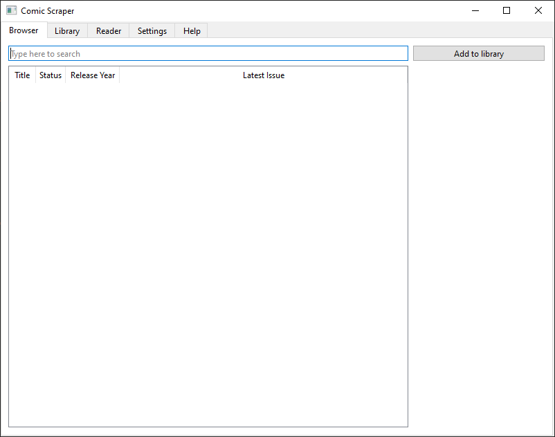
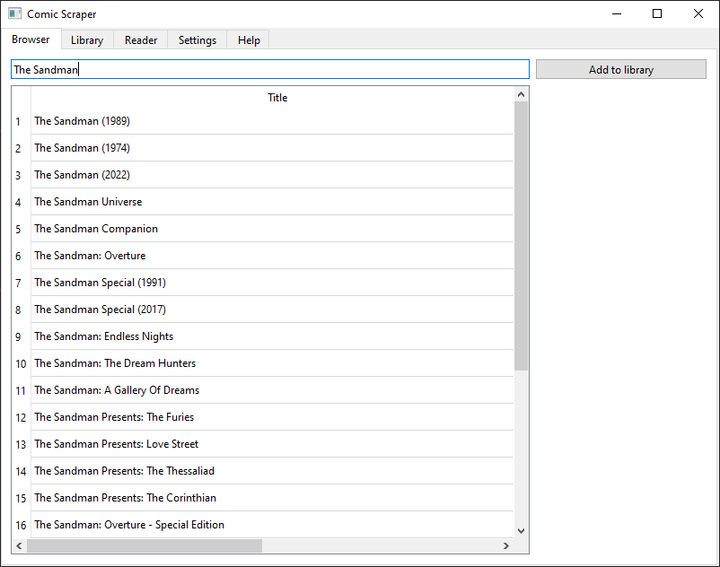
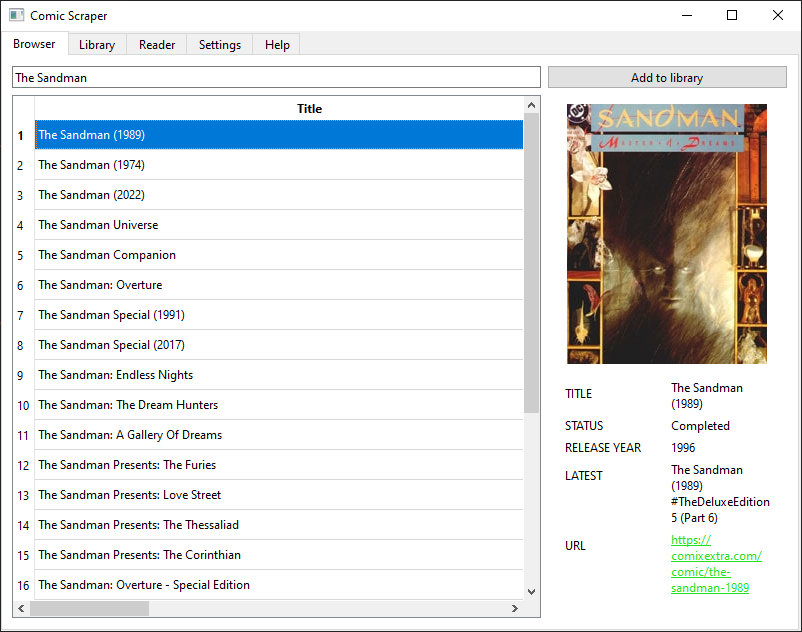
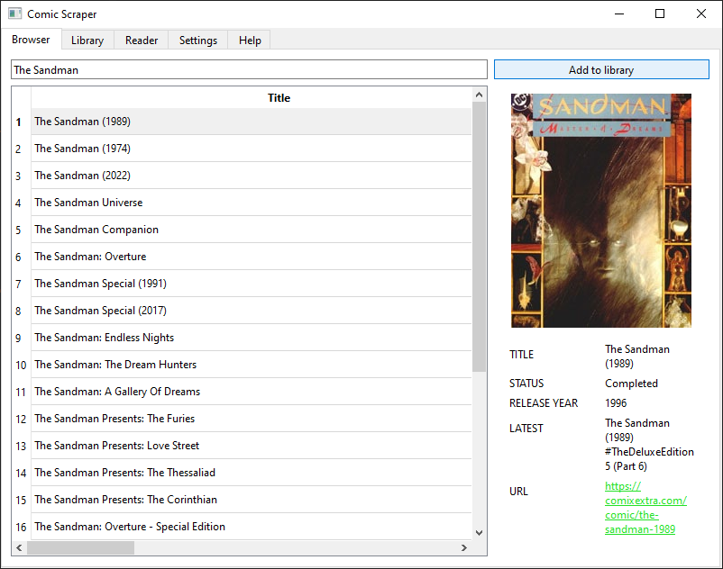
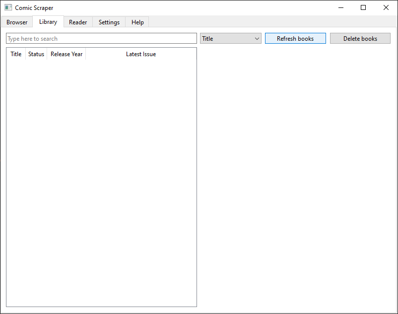
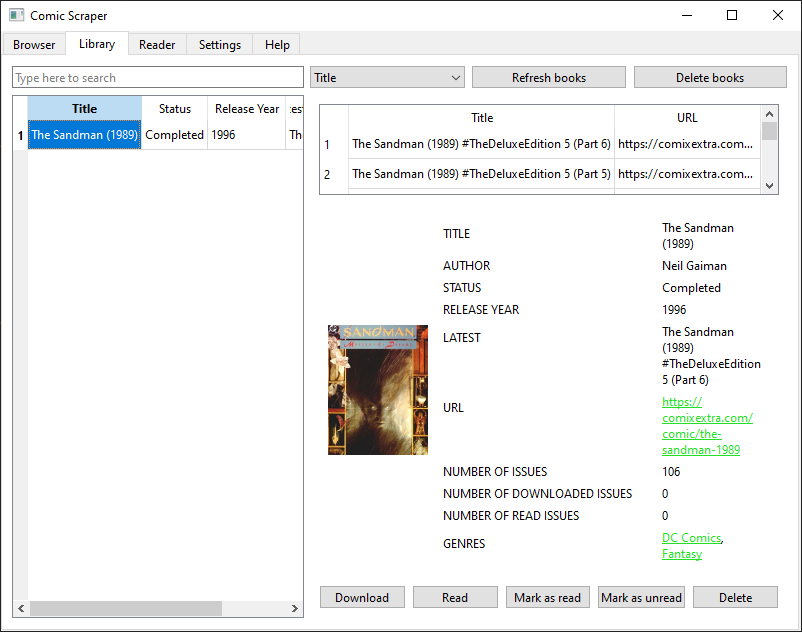
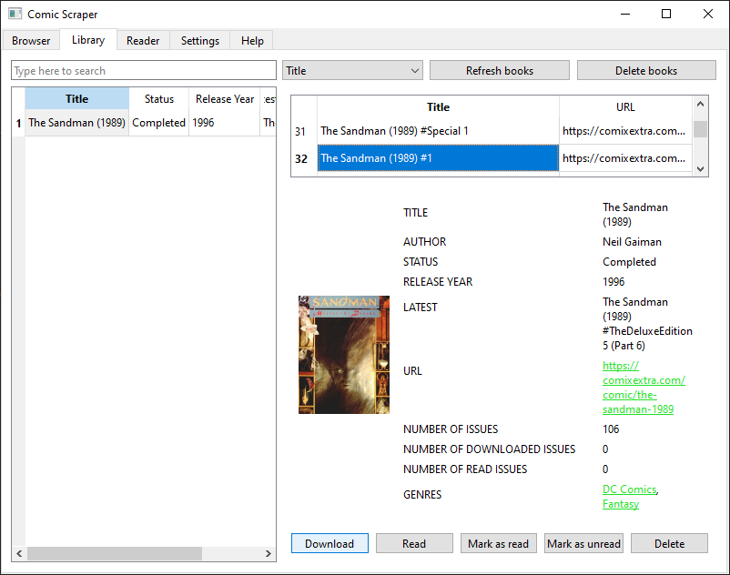
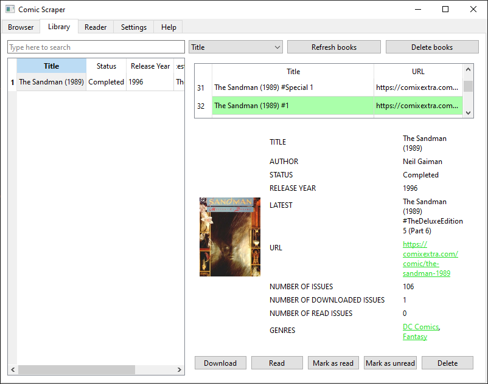
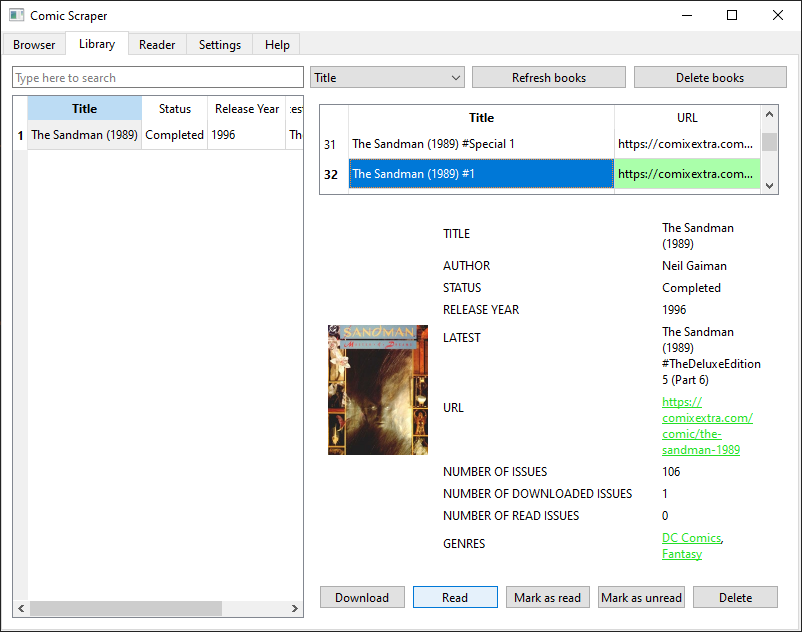
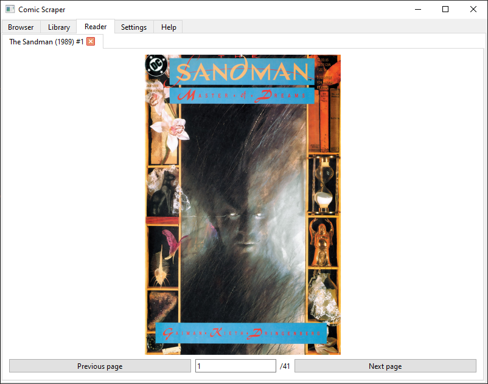

# Comic Scraper from comicextra.co, but also a reader or something

First time using pyside6 and beautiful soup

- beautiful soup +
- pyside6 ~

i hope you have a nice life

# Table of contents
- [TODO](#TODO)
- [Tutorial](#Tutorial)

# TODO:
- rename repository
- add tooltips (Library, Browser, Settings, Generic)
- add more stuff in Help tab
- add allowing more search results
- add tutorial to the README file
- add showing alternate image(s)

# Tutorial
1. Start the program, go to ***Browser*** tab (starting tab) 
2. Type a searching phrase and confirm it by pressing *Enter* on the keyboard 
3. Select book(s) 
4. Click button **Add to library** 
5. Go to the ***Library*** tab and click button **Refresh books** 
6. Choose a book and click on it 
7. Select issue(s) and click button **Download** 
8. Wait for the issue(s) to download 
9. Select issue(s) and click button **Read** 
10. Go to the ***Reader*** tab and read, use the buttons to change pages (or use arrow keys)
Tutorial created somewhere before version v2.0
